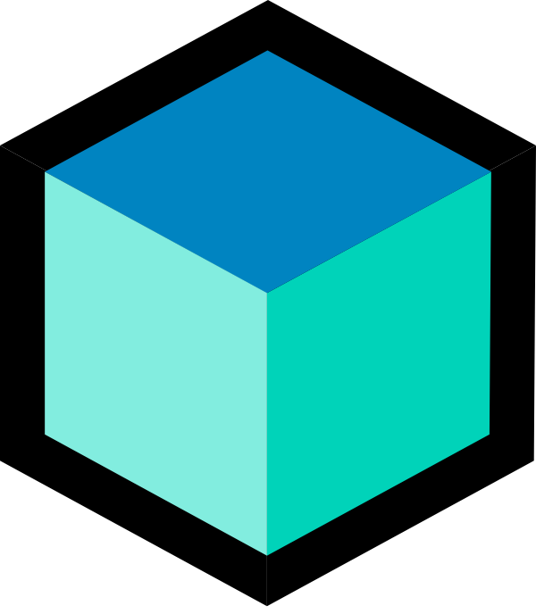

![tuna_baner][tuna_baner_path]

<h4>- 📫 Connect with me on <a href="https://www.linkedin.com/in/maksymilian-jackowski/">LinkedIn</a></h4>

<h4>- 📧 Email: <a href="mailto:maks.jackowski@proton.me">maks.jackowski@proton.me</a></h4>

<h2 align="center"><samp>💻 My Favorite Languages and Tools</samp></h2>

<table align="center">
  <tr>
    <td align="center" width="100">
       Flutter
    </td>
    <td align="center" width="100">
       Dart
    </td>
    <td align="center" width="100">
       Firebase
    </td>
    <td align="center" width="100">
       BLoC
    </td>
    <td align="center" width="100">
       SQLite
    </td>
    <td align="center" width="100">
       JavaScript
    </td>
    <td align="center" width="100">
       TypeScript
    </td>
    <td align="center" width="100">
       HTML5
    </td>
  </tr>
  <tr>
    <td align="center" width="100">
       CSS
    </td>
    <td align="center" width="100">
       Vue
    </td>
    <td align="center" width="100">
       Postman
    </td>
    <td align="center" width="100">
       GitHub
    </td>
    <td align="center" width="100">
       Codemagic
    </td>
    <td align="center" width="100">
       Linux
    </td>
    <td align="center" width="100">
       Apple
    </td>
    <td align="center" width="100">
       Windows
    </td>
  </tr>
</table>

<!--
**makjac/makjac** is a ✨ _special_ ✨ repository because its `README.md` (this file) appears on your GitHub profile.

Here are some ideas to get you started:

- 🔭 I’m currently working on ...
- 🌱 I’m currently learning ...
- 👯 I’m looking to collaborate on ...
- 🤔 I’m looking for help with ...
- 💬 Ask me about ...
- 📫 How to reach me: ...
- 😄 Pronouns: ...
- ⚡ Fun fact: ...
-->

<!-- end:excluded_rules_table -->

[tuna_baner_path]: ./makjac_banner.png
[bloc_logo]: ./bloc.png
